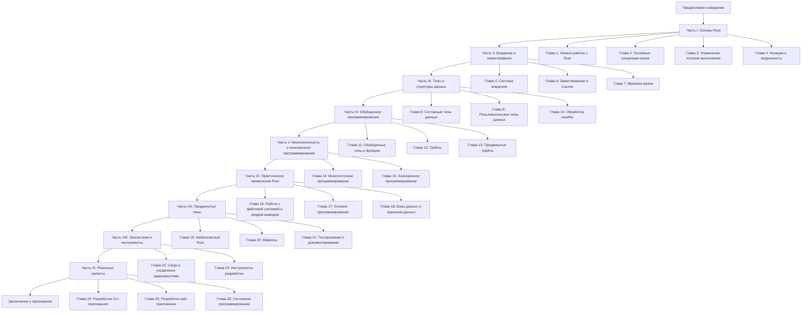

# План книги "Rust для начинающих"

На основе полученной информации я подготовил детальный план книги о Rust с сбалансированным подходом к теории и практике, ориентированный на смешанную аудиторию. План организован в виде глав и подразделов с чекбоксами для отслеживания прогресса.

## Предисловие и введение

## Часть I: Основы Rust

- [ ] **Глава 1: Начало работы с Rust**
  - [ ] Установка Rust и Cargo
  - [ ] Создание первого проекта
  - [ ] Структура проекта Rust
  - [ ] Компиляция и запуск программ
  - [ ] Практика: Создание и запуск программы "Hello, World!"

- [ ] **Глава 2: Основные концепции языка**
  - [ ] Переменные и константы
  - [ ] Базовые типы данных
  - [ ] Комментарии и документация
  - [ ] Операторы и выражения
  - [ ] Практика: Написание простой программы с использованием различных типов данных

- [ ] **Глава 3: Управление потоком выполнения**
  - [ ] Условные выражения (if, else)
  - [ ] Циклы (loop, while, for)
  - [ ] Управление циклами (break, continue)
  - [ ] Выражение match
  - [ ] Практика: Решение задач с использованием условий и циклов

- [ ] **Глава 4: Функции и модульность**
  - [ ] Определение и вызов функций
  - [ ] Параметры и возвращаемые значения
  - [ ] Функции как выражения
  - [ ] Модули и области видимости
  - [ ] Практика: Создание модульной программы с несколькими функциями

## Часть II: Владение и заимствование

- [ ] **Глава 5: Система владения**
  - [ ] Концепция владения (ownership)
  - [ ] Перемещение (move) и клонирование (clone)
  - [ ] Стек и куча
  - [ ] Время жизни переменных
  - [ ] Практика: Отслеживание владения в простых программах

- [ ] **Глава 6: Заимствование и ссылки**
  - [ ] Концепция заимствования (borrowing)
  - [ ] Изменяемые и неизменяемые ссылки
  - [ ] Правила заимствования
  - [ ] Висячие ссылки (dangling references)
  - [ ] Практика: Работа с ссылками и заимствованием

- [ ] **Глава 7: Времена жизни (Lifetimes)**
  - [ ] Концепция времен жизни
  - [ ] Аннотации времен жизни
  - [ ] Элизия времен жизни
  - [ ] Времена жизни в структурах
  - [ ] Практика: Решение проблем с временами жизни

## Часть III: Типы и структуры данных

- [ ] **Глава 8: Составные типы данных**
  - [ ] Кортежи (tuples)
  - [ ] Массивы и срезы
  - [ ] Строки и строковые срезы
  - [ ] Векторы
  - [ ] Практика: Работа с различными составными типами

- [ ] **Глава 9: Пользовательские типы данных**
  - [ ] Структуры (structs)
  - [ ] Методы и ассоциированные функции
  - [ ] Перечисления (enums)
  - [ ] Шаблон Option<T>
  - [ ] Практика: Моделирование предметной области с помощью структур и перечислений

- [ ] **Глава 10: Обработка ошибок**
  - [ ] Паника и восстановление
  - [ ] Тип Result<T, E>
  - [ ] Оператор ? и распространение ошибок
  - [ ] Создание собственных типов ошибок
  - [ ] Практика: Реализация надежной обработки ошибок

## Часть IV: Обобщенное программирование

- [ ] **Глава 11: Обобщенные типы и функции**
  - [ ] Параметры типа
  - [ ] Обобщенные функции
  - [ ] Обобщенные структуры и перечисления
  - [ ] Ограничения типов
  - [ ] Практика: Создание обобщенных структур данных

- [ ] **Глава 12: Трейты**
  - [ ] Определение и реализация трейтов
  - [ ] Трейты как параметры
  - [ ] Ограничения трейтов
  - [ ] Стандартные трейты
  - [ ] Практика: Реализация трейтов для пользовательских типов

- [ ] **Глава 13: Продвинутые трейты**
  - [ ] Ассоциированные типы
  - [ ] Реализация трейтов по умолчанию
  - [ ] Трейты-маркеры
  - [ ] Трейты для операторов
  - [ ] Практика: Создание библиотеки с использованием трейтов

## Часть V: Многопоточность и асинхронное программирование

- [ ] **Глава 14: Многопоточное программирование**
  - [ ] Потоки в Rust
  - [ ] Передача данных между потоками
  - [ ] Разделяемое состояние
  - [ ] Мьютексы и другие примитивы синхронизации
  - [ ] Практика: Создание многопоточного приложения

- [ ] **Глава 15: Асинхронное программирование**
  - [ ] Концепции асинхронного программирования
  - [ ] Futures и async/await
  - [ ] Токио и другие асинхронные среды выполнения
  - [ ] Асинхронный ввод-вывод
  - [ ] Практика: Разработка асинхронного сервера

## Часть VI: Практическое применение Rust

- [ ] **Глава 16: Работа с файловой системой и вводом-выводом**
  - [ ] Чтение и запись файлов
  - [ ] Работа с путями
  - [ ] Буферизованный ввод-вывод
  - [ ] Сериализация и десериализация данных
  - [ ] Практика: Создание утилиты для работы с файлами

- [ ] **Глава 17: Сетевое программирование**
  - [ ] Основы сетевого программирования
  - [ ] TCP и UDP соединения
  - [ ] HTTP-клиенты и серверы
  - [ ] Работа с веб-API
  - [ ] Практика: Разработка простого веб-сервера

- [ ] **Глава 18: Базы данных и хранение данных**
  - [ ] Подключение к базам данных
  - [ ] ORM в Rust
  - [ ] Работа с SQL и NoSQL
  - [ ] Кэширование и оптимизация
  - [ ] Практика: Создание приложения с использованием базы данных

## Часть VII: Продвинутые темы

- [ ] **Глава 19: Небезопасный Rust**
  - [ ] Блоки unsafe
  - [ ] Работа с сырыми указателями
  - [ ] FFI и взаимодействие с C
  - [ ] Безопасные абстракции над небезопасным кодом
  - [ ] Практика: Создание безопасной обертки над C-библиотекой

- [ ] **Глава 20: Макросы**
  - [ ] Декларативные макросы
  - [ ] Процедурные макросы
  - [ ] Атрибуты и деривация
  - [ ] Создание собственных макросов
  - [ ] Практика: Разработка полезных макросов для упрощения кода

- [ ] **Глава 21: Тестирование и документирование**
  - [ ] Модульное тестирование
  - [ ] Интеграционное тестирование
  - [ ] Бенчмаркинг
  - [ ] Документирование кода
  - [ ] Практика: Написание тестов и документации для библиотеки

## Часть VIII: Экосистема и инструменты

- [ ] **Глава 22: Cargo и управление зависимостями**
  - [ ] Расширенные возможности Cargo
  - [ ] Рабочие пространства
  - [ ] Публикация пакетов на crates.io
  - [ ] Семантическое версионирование
  - [ ] Практика: Создание и публикация библиотеки

- [ ] **Глава 23: Инструменты разработки**
  - [ ] Rustfmt и форматирование кода
  - [ ] Clippy и статический анализ
  - [ ] Отладка программ на Rust
  - [ ] Профилирование и оптимизация
  - [ ] Практика: Настройка среды разработки и рабочего процесса

## Часть IX: Реальные проекты

- [ ] **Глава 24: Разработка CLI-приложения**
  - [ ] Парсинг аргументов командной строки
  - [ ] Интерактивный ввод
  - [ ] Цветной вывод и прогресс-бары
  - [ ] Обработка сигналов
  - [ ] Практика: Создание полноценного CLI-инструмента

- [ ] **Глава 25: Разработка веб-приложения**
  - [ ] Веб-фреймворки в Rust
  - [ ] Маршрутизация и обработка запросов
  - [ ] Шаблонизация и рендеринг
  - [ ] Аутентификация и авторизация
  - [ ] Практика: Разработка веб-приложения с базой данных

- [ ] **Глава 26: Системное программирование**
  - [ ] Работа с процессами и потоками ОС
  - [ ] Низкоуровневый ввод-вывод
  - [ ] Взаимодействие с операционной системой
  - [ ] Разработка драйверов и системных компонентов
  - [ ] Практика: Создание системной утилиты

## Заключение и приложения

- [ ] **Заключение**
  - [ ] Обзор пройденного материала
  - [ ] Дальнейшие шаги в изучении Rust
  - [ ] Ресурсы для продолжения обучения

- [ ] **Приложение A: Шпаргалка по синтаксису Rust**
  - [ ] Краткий справочник по синтаксису
  - [ ] Часто используемые конструкции
  - [ ] Типичные шаблоны кода

- [ ] **Приложение B: Популярные библиотеки и крейты**
  - [ ] Обзор экосистемы Rust
  - [ ] Рекомендуемые библиотеки по категориям
  - [ ] Как выбирать библиотеки для своих проектов

- [ ] **Приложение C: Глоссарий**
  - [ ] Термины и определения
  - [ ] Сокращения и аббревиатуры

- [ ] **Приложение D: Ответы к упражнениям**
  - [ ] Решения практических заданий
  - [ ] Объяснения и альтернативные подходы

## Диаграмма структуры книги



## Диаграмма зависимостей между темами

```mermaid
flowchart TD
    A[Основы Rust] --> B[Владение и заимствование]
    A --> C[Типы данных]
    B --> D[Времена жизни]
    C --> E[Пользовательские типы]
    E --> F[Трейты]
    F --> G[Обобщенное программирование]
    B --> H[Многопоточность]
    G --> I[Асинхронное программирование]
    A --> J[Обработка ошибок]
    J --> K[Практическое применение]
    F --> L[Макросы]
    B --> M[Небезопасный Rust]
    A --> N[Инструменты разработки]
    K --> O[Реальные проекты]